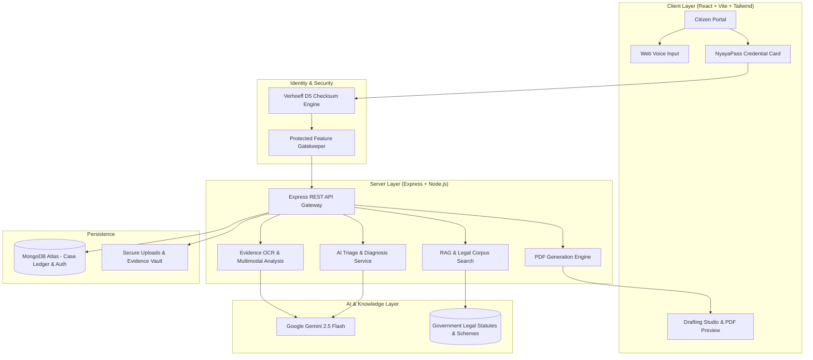

<div align="center">

# ⚖️ NyayaSetu (न्याय सेतु)
### Sovereign AI Civic & Legal Action Engine for Indian Citizens

[](https://reactjs.org/)
[](https://vitejs.dev/)
[](https://nodejs.org/)
[](https://expressjs.com/)
[](https://ai.google.dev/)
[](https://www.mongodb.com/)
[](https://tailwindcss.com/)
[](LICENSE)

<p align="center">
  <b>Bridging the Gap between Citizens and Justice through Sovereign AI, Statutory Diagnosis, Evidence Forensics & Automated Legal Drafting.</b>
</p>

</div>

---

## 📌 Table of Contents

- [🏛️ About NyayaSetu](#️-about-nyayasetu)
- [✨ Core Capabilities](#-core-capabilities)
- [🏗️ System Architecture](#️-system-architecture)
- [📂 Repository Structure](#-repository-structure)
- [🚀 Quick Start & Installation](#-quick-start--installation)
  - [Prerequisites](#prerequisites)
  - [1. Backend Setup](#1-backend-setup-nyayasetu-server)
  - [2. Frontend Setup](#2-frontend-setup-client)
- [📡 API Documentation](#-api-documentation)
- [📜 Statutory Law & Compliance Matrix](#-statutory-law--compliance-matrix)
- [🔐 Privacy & Data Sovereignty](#-privacy--data-sovereignty)
- [👥 Core Team & Authors](#-core-team--authors)
- [🤝 Contributing](#-contributing)
- [📄 License & Disclaimer](#-license--disclaimer)

---

## 🏛️ About NyayaSetu

**NyayaSetu (न्याय सेतु)** is an institutional-grade, citizen-first legal intelligence and civic grievance redressal platform engineered specifically for the Indian legal framework.

Access to justice in India is frequently hampered by procedural complexity, legalese, the transition to new criminal statutes (**Bharatiya Nyaya Sanhita 2023**, **BNSS 2023**, **BSA 2023**), and the high financial barrier of formal pre-litigation documentation. 

**NyayaSetu** empowers every citizen with:
1. **Mathematical Identity Integrity:** UIDAI Verhoeff Dihedral Checksum ($D_5$) verification.
2. **Sovereign Access Key:** Lifetime unique `NyayaPass` credential card (`NP-2026-XXXX-XX-IN`).
3. **Statutory AI Triage:** Instant diagnosis grounded in central acts, consumer laws, tenancy codes, and fundamental rights.
4. **Multimodal OCR Forensics:** Evidence extraction from bills, agreements, WhatsApp chats, and FIR endorsements.
5. **Pre-Litigation Drafting Studio:** Automated generation of formal Consumer Notices, RTI applications, and Police Petitions with instant PDF download.
6. **Reverse Welfare Matcher:** Eligibility engine linking citizens with Central/State government schemes and highlighting document gaps.
7. **Bilingual Accessibility:** Native support for English and हिन्दी with voice grievance recording.

---

## ✨ Core Capabilities

### 🔒 1. UIDAI Aadhaar Verification & NyayaPass Key Gateway
- **Verhoeff Dihedral Checksum Validation:** Mathematically verifies 12-digit Aadhaar sequences to prevent invalid or counterfeit registrations without storing raw biometric payloads.
- **Unique NyayaPass ID (`NP-2026-XXXX-XX-IN`):** Issues a cryptographically signed citizen pass card with 1-click credential copying and print-ready digital identity card.
- **Sovereign Feature Gatekeeper:** Unlocks case vaults, drafting studios, and diagnostic engines upon verified authentication.

### ⚖️ 2. AI Legal Triage & Rights Diagnosis Engine
- Powered by **Google Gemini 2.5 Flash** with statutory prompt guards.
- Analyzes plain-language grievances and maps them to applicable sections:
  - **Criminal / Public Safety:** BNS 2023, BNSS 2023 (**Zero FIR Right** under Section 173), POCSO Act, IT Act (Sec 66E/67).
  - **Consumer Redressal:** Consumer Protection Act 2019 (Sec 35, e-Daakhil filing eligibility).
  - **Tenancy Disputes:** Model Tenancy Act 2021 (Unlawful deposit withholding, Sec 11 notice requirements).
  - **Information & Governance:** Right to Information (RTI) Act 2005 (Sec 6(1) filing).
  - **Healthcare & Emergency Rights:** Ayushman Bharat (PM-JAY) Charter & Emergency Hospital Admission Rights.

### 📷 3. Forensic Evidence Vault & Multimodal OCR
- Ingests bills, cash receipts, rent agreements, chat exports, and police endorsements.
- Extracts merchant particulars, transaction timestamps, transaction IDs, defect descriptions, and highlights evidentiary omissions before formal filing.

### 📜 4. Automated Legal Notice Drafting Studio
- Auto-generates structured, legally enforceable drafts with statutory formatting:
  - **Pre-Litigation Consumer Demand Notice** (with statutory 15-day cure window).
  - **Section 6(1) RTI Application** addressed to Public Information Officers (PIOs).
  - **Model Tenancy Security Deposit Refund Notice** under State Tenancy Provisions.
  - **Zero FIR Representation / Police Complaint** under BNSS Section 173.
- Instant export to printable **PDF** with digital verification stamps and QR code validation.

### 🏛️ 5. Reverse Welfare Scheme Matcher & Document-Gap Engine
- Matches citizen profiles (Age, Gender, State, Income, Social Category) with central and state schemes:
  - *PM-JAY (Ayushman Bharat)*
  - *PM-KISAN Samman Nidhi*
  - *Sukanya Samriddhi Yojana*
  - *Pradhan Mantri Awas Yojana (PMAY)*
  - *Old Age Pension / EWS Scholarships*
- Detects missing documents needed to qualify and issues an actionable Document-Gap Checklist.

### 📍 6. National Jurisdiction & Free Legal Aid Finder
- Integrated geo-jurisdiction registry for:
  - District Consumer Disputes Redressal Commissions (**DCDRC**).
  - District Legal Services Authorities (**DLSA / NALSA**) offering free legal aid under Section 12 of the Legal Services Authorities Act, 1987.
  - State Information Commissions (**SIC**).
  - Municipal grievance escalations (CM Helpline / 1076 / Swachhata).

---

## 🏗️ System Architecture



---

## 📂 Repository Structure

```plaintext
NayayaSetu/
├── client/                           # React + Vite Frontend
│   ├── src/
│   │   ├── components/
│   │   │   ├── auth/                 # AuthModal, NyayaPassCard, ProtectedFeatureGate
│   │   │   ├── civic/                # Civic Grievance Dashboard
│   │   │   ├── common/               # Navbar, TopUtilityBar, EmergencyBanner, Footer
│   │   │   ├── diagnosis/            # AI Triage & Rights Diagnosis Section
│   │   │   ├── drafting/             # Notice & Petition Drafting Studio & PDF Preview
│   │   │   ├── evidence/             # Forensic Evidence Vault & OCR Inspector
│   │   │   ├── home/                 # Institutional Landing View & Grievance Categories
│   │   │   ├── jurisdiction/         # District Consumer & Free Legal Aid Finder
│   │   │   ├── schemes/              # Welfare Scheme Matcher & Document-Gap Engine
│   │   │   ├── tracker/              # Statutory Limitation & Case Tracker
│   │   │   └── wiki/                 # Knowledge Base & Citizen Rights Wiki
│   │   ├── context/                  # AuthContext, CaseContext, LanguageContext
│   │   ├── services/                 # api.js, mockData.js, voiceService.js
│   │   ├── App.jsx                   # Main Institutional Router
│   │   ├── index.css                 # Custom Styling & Typography
│   │   └── main.jsx                  # React DOM Entrypoint
│   ├── package.json
│   ├── tailwind.config.js
│   └── vite.config.js
│
├── nyayasetu-server/                 # Node.js + Express Backend API
│   ├── config/                       # Database Connection (MongoDB / Mongoose)
│   ├── controllers/                  # auth, intake, draft, evidence, rag, civic controllers
│   ├── middlewares/                  # Error Handling & Multer Upload Middleware
│   ├── models/                       # Case.js, UserRepository.js, Scheme.js, Source.js
│   ├── routes/                       # Express Route Definitions
│   ├── services/                     # Gemini AI, OCR, PDF Generation, RAG Pipeline
│   ├── server.js                     # Express Server Entrypoint
│   ├── package.json
│   └── .env.example                  # Environment Template
│
├── .gitignore                        # Root Git Ignore
├── LICENSE                           # MIT License
└── README.md                         # Project Documentation
```

---

## 🚀 Quick Start & Installation

### Prerequisites
- **Node.js** v18.0.0 or higher
- **npm** or **yarn**
- **MongoDB** (Local instance or MongoDB Atlas URI)
- **Google Gemini API Key** ([Get your free API key from Google AI Studio](https://aistudio.google.com/))

---

### 1. Backend Setup (`nyayasetu-server`)

1. Clone the repository:
   ```bash
   git clone https://github.com/garishabansal84-rgb/NayayaSetu.git
   cd NayayaSetu/nyayasetu-server
   ```

2. Install dependencies:
   ```bash
   npm install
   ```

3. Configure environment variables:
   ```bash
   cp .env.example .env
   ```
   Edit `.env` and fill in your values:
   ```env
   PORT=5005
   NODE_ENV=development
   FRONTEND_URL=http://localhost:3000
   MONGODB_URI=mongodb://localhost:27017/nyayasetu
   GEMINI_API_KEY=your_google_gemini_api_key_here
   ```

4. Launch the backend server:
   ```bash
   npm start
   # Or for development with nodemon:
   npm run dev
   ```
   > Backend runs on `http://localhost:5005`

---

### 2. Frontend Setup (`client`)

1. In a new terminal, navigate to the `client` directory:
   ```bash
   cd ../client
   ```

2. Install dependencies:
   ```bash
   npm install
   ```

3. Start the Vite development server:
   ```bash
   npm run dev
   ```

4. Open your browser and navigate to:
   ```plaintext
   http://localhost:3000
   ```

---

## 📡 API Documentation

| Method | Endpoint | Description | Auth Required |
| :--- | :--- | :--- | :---: |
| `POST` | `/api/auth/verify-aadhaar` | Verifies 12-digit Aadhaar using Verhoeff Dihedral Checksum | No |
| `POST` | `/api/auth/signup` | Registers user & generates unique `NyayaPass` access key | Yes (Aadhaar Validated) |
| `POST` | `/api/auth/login` | Authenticates via NyayaPass Key or verified credentials | No |
| `POST` | `/api/auth/verify-key` | Fast verification of active NyayaPass Keys | No |
| `GET` | `/api/auth/verify-pass/:id` | Public verification endpoint for QR code pass validation | No |
| `POST` | `/api/intake/diagnose` | AI legal triage & rights diagnosis under Indian statutes | Yes |
| `POST` | `/api/rag/query` | RAG retrieval across legal corpus and government schemes | Yes |
| `POST` | `/api/evidence/upload` | Ingests receipts, agreements, chats for forensic OCR | Yes |
| `POST` | `/api/drafts/generate` | Generates official formatted legal notices & petitions | Yes |
| `GET` | `/api/drafts/download/:id` | Downloads drafted document as a stamped PDF | Yes |
| `POST` | `/api/schemes/match` | Matches user demographics against welfare schemes | Yes |
| `POST` | `/api/civic-analysis/analyze` | Municipal civic grievance triage & escalation drafting | Yes |

---

## 📜 Statutory Law & Compliance Matrix

NyayaSetu is aligned with modern Indian statutory frameworks:

| Area of Law | Governed Statute | Institutional Feature |
| :--- | :--- | :--- |
| **Criminal Law** | Bharatiya Nagarik Suraksha Sanhita (BNSS 2023) | Zero FIR Petition generation under Section 173 |
| **Penal Code** | Bharatiya Nyaya Sanhita (BNS 2023) | Offence categorization & penalty identification |
| **Consumer Rights** | Consumer Protection Act, 2019 | 15-day pre-litigation demand notice generator |
| **Tenancy & Rent** | Model Tenancy Act, 2021 | Security deposit recovery notice under Section 11 |
| **Public Transparency** | Right to Information Act, 2005 | Formatted Section 6(1) RTI applications |
| **Cyber Law** | Information Technology Act, 2000 | Sections 66E / 67 privacy violation drafting |
| **Free Legal Aid** | Legal Services Authorities Act, 1987 | Auto-eligibility detection for DLSA / NALSA representation |
| **Data Privacy** | Digital Personal Data Protection Act (DPDP 2023) | Aadhaar masking (`XXXX-XXXX-1234`) & zero raw biometric storage |

---

## 🔐 Privacy & Data Sovereignty

- **No Raw Aadhaar Storage:** Aadhaar numbers are validated locally in-memory using the mathematical Verhoeff algorithm. Only masked identifiers (`XXXX-XXXX-1234`) and SHA-256 hashes are stored.
- **Client-Side Data Integrity:** User grievance inputs are isolated by unique NyayaPass credentials.
- **Zero Third-Party Ad Trackers:** Clean, secure, institutional interface built with public service ethics.

---

## 👥 Core Team & Authors

NyayaSetu was designed, engineered, and built collaboratively by:

| Contributor | Role & Contributions | GitHub |
| :--- | :--- | :--- |
| **Garisha Bansal** | Full-Stack Engineering, AI Legal Inference & Architecture | [@garishabansal84-rgb](https://github.com/garishabansal84-rgb) |
| **Tanvi Makhija** | Full-Stack Engineering, Civic Technology & Statutory Systems | [@Tanvi-tech612](https://github.com/Tanvi-tech612) |

---

## 🤝 Contributing

We welcome contributions from developers, legal professionals, and policy enthusiasts!

1. Fork the repository
2. Create your feature branch (`git checkout -b feature/AmazingFeature`)
3. Commit your changes (`git commit -m 'Add some AmazingFeature'`)
4. Push to the branch (`git push origin feature/AmazingFeature`)
5. Open a Pull Request

---

## 📄 License & Disclaimer

This project is licensed under the **MIT License** - see the [LICENSE](LICENSE) file for details.

> [!IMPORTANT]
> **Legal Notice:** NyayaSetu is an AI-driven civic empowerment and pre-litigation orientation platform. It does not replace formal legal counsel or create an advocate-client relationship. Citizens are encouraged to seek certified legal assistance or approach their local District Legal Services Authority (DLSA) when participating in formal judicial proceedings.

<div align="center">
  <sub>Built with ❤️ for Citizen Empowerment and Sovereign Digital Justice in India.</sub>
</div>
