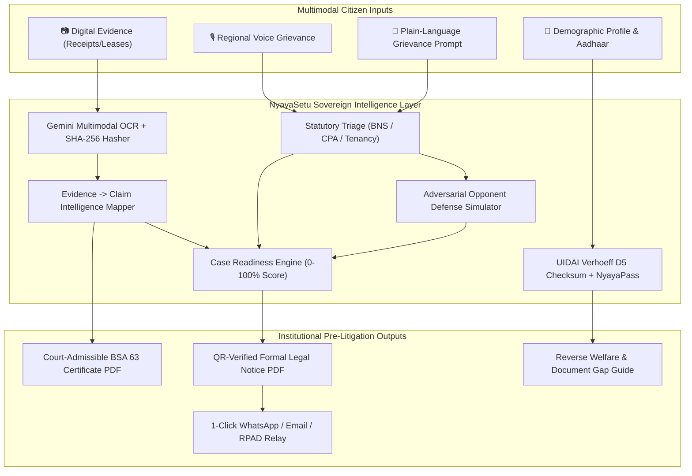
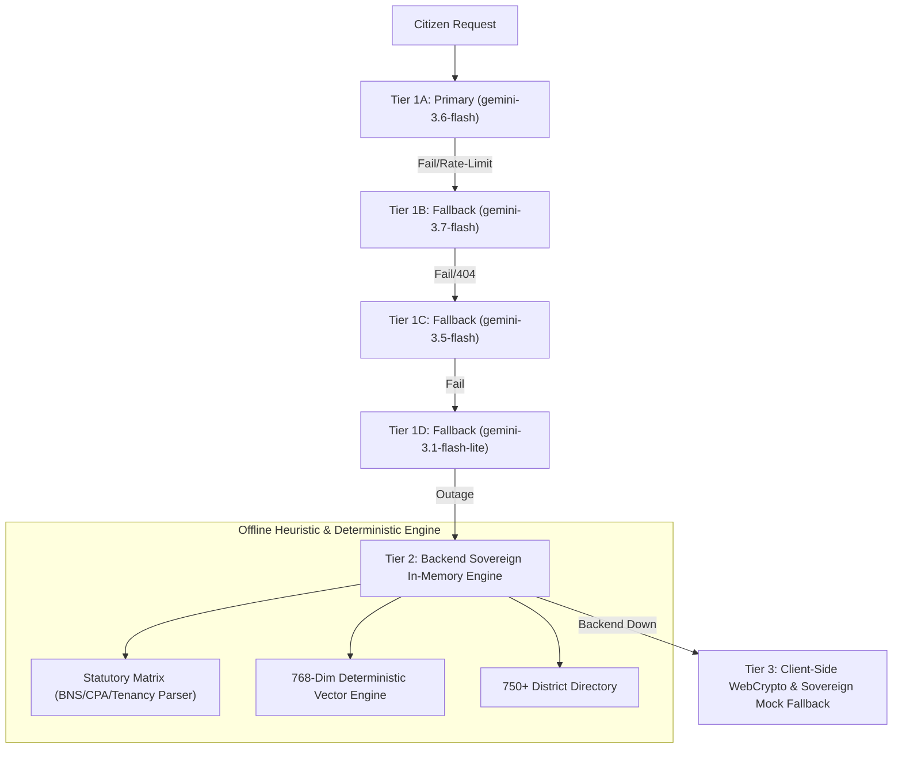

<div align="center">

# ⚖️ NyayaSetu (न्याय सेतु)
### Sovereign AI Civic & Pre-Litigation Decision-Support Engine for Indian Citizens

[](https://reactjs.org/)
[](https://vitejs.dev/)
[](https://nodejs.org/)
[](https://expressjs.com/)
[](https://ai.google.dev/)
[](https://tailwindcss.com/)
[](https://indiacode.nic.in)
[](LICENSE)

<p align="center">
  <b>Bridging the Gap between Citizens and Justice through Sovereign AI, Statutory Diagnosis, SHA-256 BSA 63 Evidence Forensics, Case Readiness Intelligence & Automated Legal Drafting.</b>
</p>

</div>

---

## 📌 Table of Contents

- [🏛️ About NyayaSetu](#️-about-nyayasetu)
- [✨ Key Innovations & Core Modules](#-key-innovations--core-modules)
  - [1. Case Intelligence & Readiness Engine (0–100%)](#1--case-intelligence--readiness-engine-0100)
  - [2. Evidence → Claim Intelligence Map](#2--evidence--claim-intelligence-map)
  - [3. "Why Do You Need This?" Evidentiary Explanations](#3--why-do-you-need-this-evidentiary-explanations)
  - [4. Adversarial Opponent Defense Simulator (AI Wargamer)](#4-️-adversarial-opponent-defense-simulator-ai-wargamer)
  - [5. BSA 2023 Section 63 SHA-256 Digital Certificate Engine](#5--bsa-2023-section-63-sha-256-digital-certificate-engine)
  - [6. AI Legal Triage & Multimodal Forensic OCR](#6-⚖️-ai-legal-triage--multimodal-forensic-ocr)
  - [7. Automated Legal Notice Studio & Dispatch Relay](#7-📜-automated-legal-notice-studio--dispatch-relay)
  - [8. UIDAI Verhoeff Checksum & NyayaPass](#8--uidai-verhoeff-checksum--nyayapass)
  - [9. Reverse Welfare Scheme Matcher](#9-🏛️-reverse-welfare-scheme-matcher)
- [🏗️ System Architecture & Multimodal Pipeline](#️-system-architecture--multimodal-pipeline)
- [🛡️ Multi-Tier Auto-Failover Architecture](#️-multi-tier-auto-failover-architecture)
- [📂 Repository Structure](#-repository-structure)
- [🚀 Quick Start & Installation](#-quick-start--installation)
- [🧪 End-to-End Testing & Demo Script](#-end-to-end-testing--demo-script)
- [📜 Statutory Law & Compliance Matrix](#-statutory-law--compliance-matrix)
- [📄 License & Institutional Disclaimer](#-license--institutional-disclaimer)

---

## 🏛️ About NyayaSetu

**NyayaSetu (न्याय सेतु)** is an institutional-grade, citizen-first legal decision-support system engineered specifically for the Indian judicial and civic framework.

Access to justice in India is frequently hindered by procedural complexity, legalese, the transition to new criminal statutes (**Bharatiya Nyaya Sanhita 2023**, **BNSS 2023**, **Bharatiya Sakshya Adhiniyam 2023**), unverified digital evidence, and high pre-litigation advocate fees. 

**NyayaSetu** empowers every citizen with:
1. **Case Readiness Intelligence:** Transparent 0–100% readiness score evaluated across 6 statutory pillars.
2. **Evidence-to-Claim Mapping:** Real-time linkage of uploaded receipts to specific legal causes of action.
3. **Adversarial AI Wargaming:** Red-teaming citizen claims from the perspective of corporate defense advocates.
4. **BSA 2023 Section 63 Certification:** Automated generation of court-admissible electronic evidence affidavits with SHA-256 cryptographic seals.
5. **Pre-Litigation Notice Studio:** QR-verified notice drafting with 1-click WhatsApp/Speed Post dispatch relay.
6. **UIDAI Verhoeff $D_5$ Validation:** Secure digital `NyayaPass` citizen identity credentials.

---

## ✨ Key Innovations & Core Modules

### 1. 📊 Case Intelligence & Readiness Engine (0–100%)
* **Transparent Rule-Based Scoring:** Evaluates real-time case state across **6 Institutional Pillars**:
  1. *Legal Triage & Rights Diagnosis (20 pts)*
  2. *Forensic Evidence & Claim Custody (25 pts)*
  3. *Statutory Limitation & Timeline (15 pts)*
  4. *Legal Notice Draft Readiness (15 pts)*
  5. *Territorial Forum & Jurisdiction (15 pts)*
  6. *Welfare & Free Legal Aid Entitlement (10 pts)*
* **Next Best Action Hero Banner:** Intelligently recommends the single most effective action (*e.g., "Upload proof of payment"*) to elevate case readiness.
* **Evidentiary Gap Auditor:** Detects missing documents and links directly to resolution pathways.

---

### 2. 🗺️ Evidence → Claim Intelligence Map
* Upgrades simple document storage into a structured **Cause-of-Action Linker**:
  - Automatically identifies claims from the case (*e.g., Consideration paid, Statutory service deficiency, Arbitrary deposit retention*).
  - Connects uploaded receipts, invoices, and lease deeds directly to claims.
  - Computes dynamic **Claim Strength** (`STRONG SUPPORT`, `MODERATE SUPPORT`, `NEEDS SUPPORT`).
  - Highlights specific missing evidence items required to bulletproof each individual claim.

---

### 3. ❓ "Why Do You Need This?" Evidentiary Explanations
* Embedded context-aware explainer component (`WhyNeeded.jsx`) across all document requirements:
  - Explains the plain-language legal purpose of every document (*e.g., Proof of Payment, Income Certificate, Tenancy Agreement, Identity Proof*).
  - Outlines the governing Indian statute (*e.g., Contract Act 1872, CPA 2019, Model Tenancy Act, BSA 2023*).
  - Displays the direct numerical impact on case readiness and accepted file formats.

---

### 4. ⚔️ Adversarial Opponent Defense Simulator (AI Wargamer)
* **Red-Team Counter-Strategy Engine:** Evaluates claims from the perspective of an aggressive corporate defense advocate (Amazon, Flipkart, Landlord, Real Estate Developer).
* **Outputs:**
  - *Simulated Opposing Legal Persona & Strategic Posture.*
  - *Pre-Litigation Settlement Likelihood Index (0–100%).*
  - *Anticipated Counter-Arguments & Contractual Defense Clauses.*
  - *Pre-Emptive Legal Rebuttals with Landmark Supreme Court / High Court Citations.*
  - *Pre-Emptive Tactical Shield Action Checklist.*

---

### 5. 🛡️ BSA 2023 Section 63 SHA-256 Digital Certificate Engine
* Under **Section 63(4) of the Bharatiya Sakshya Adhiniyam, 2023**, electronic evidence (WhatsApp chats, UPI receipts, bills) is inadmissible in Indian courts without cryptographic certification.
* **NyayaSetu SHA-256 Pipeline:**
  - Browser-side **WebCrypto API** computes a 256-bit SHA-256 digest upon upload.
  - Server verifies the raw binary buffer using Node.js native `crypto`.
  - Generates an official, court-ready **Section 63 BSA PDF Certificate** with device metadata, continuous custody affirmation, tricolor seal, and QR code verification.

---

### 6. ⚖️ AI Legal Triage & Multimodal Forensic OCR
* Analyzes plain-language grievances in English, Hindi, and regional voice recordings.
* Maps dispute facts to statutory remedy pathways:
  - **Criminal / Safety:** BNS 2023, BNSS 2023 (Mandatory **Zero FIR** under Sec 173), POCSO Act.
  - **Consumer Law:** Consumer Protection Act 2019 (Sec 35 & e-Daakhil filing eligibility).
  - **Tenancy:** Model Tenancy Act 2021 (Unlawful deposit withholding, Sec 11 notice requirements).
  - **Information:** Right to Information (RTI) Act 2005 (Sec 6(1) filing).
* Forensic OCR automatically extracts merchant GSTIN, transaction date, claim consideration, and contractual breach clauses with inline manual editing.

---

### 7. 📜 Automated Legal Notice Studio & Dispatch Relay
* Generates structured statutory notices with enforceable prayer clauses:
  - **Pre-Litigation Consumer Demand Notice** (15-day statutory cure period).
  - **Section 6(1) RTI Application** to Public Information Officers (PIOs).
  - **Model Tenancy Deposit Refund Notice** under State Tenancy Provisions.
  - **Zero FIR Representation / Police Complaint** under BNSS Section 173.
* **1-Click Multi-Channel Relay:** Instant pre-filled dispatch via WhatsApp, Email, or printable Registered Post (RPAD) postal slips.

---

### 8. 🔑 UIDAI Verhoeff Checksum & NyayaPass
* **Verhoeff Dihedral Checksum ($D_5$):** Validates 12-digit Aadhaar sequences to eliminate transcription errors without storing raw biometrics.
* **Unique NyayaPass ID (`NP-2026-XXXX-XX-IN`):** Issues a cryptographically signed citizen pass card for 1-click access across all decision-support modules.

---

### 9. 🏛️ Reverse Welfare Scheme Matcher
* Evaluates demographic profiles against 15+ Central and State welfare programs (PM-JAY Ayushman Bharat, NALSA Free Legal Aid Sec 12, PM-KISAN, PMAY).
* Generates an actionable **Document-Gap Checklist** detailing missing certificates and e-District procurement steps.

---

## 🏗️ System Architecture & Multimodal Pipeline



---

## 🛡️ Multi-Tier Auto-Failover Architecture

NyayaSetu implements a **3-tier failover ladder** ensuring uninterrupted operation even during cloud outages:



---

## 📂 Repository Structure

```
NayayaSetu/
├── client/                               # Frontend (React 18 + Vite 6 + Tailwind CSS)
│   ├── src/
│   │   ├── components/
│   │   │   ├── auth/                     # AuthModal, NyayaPassCard, ProtectedFeatureGate
│   │   │   ├── caseIntelligence/        # CaseReadiness.jsx (Feature 1 Dashboard)
│   │   │   ├── common/                   # Navbar, TopUtilityBar, WhyNeeded.jsx (Feature 3)
│   │   │   ├── diagnosis/                # DiagnosisSection, OpponentWargameSimulator
│   │   │   ├── drafting/                 # DraftingStudio, PDFPreviewModal, LegalDispatchRelayModal
│   │   │   ├── evidence/                 # EvidenceVault, EvidenceClaimMap (Feature 2), BSACertificateModal
│   │   │   ├── jurisdiction/             # JurisdictionFinder (750+ Districts)
│   │   │   ├── schemes/                  # SchemeMatcher, DocumentGapCard
│   │   │   └── tracker/                  # CaseTracker (Statutory Timelines)
│   │   ├── context/                      # CaseContext.jsx, AuthContext.jsx, LanguageContext.jsx
│   │   ├── services/
│   │   │   ├── api.js                    # REST Client, WebCrypto SHA-256 Hasher
│   │   │   ├── caseReadinessEngine.js    # 0-100% Case Readiness Rule Engine
│   │   │   ├── evidenceClaimEngine.js    # Evidence -> Claim Relationship Engine
│   │   │   ├── whyNeededCatalog.js       # Statutory Rationale & Why Needed Catalog
│   │   │   └── voiceService.js           # Bhashini / Web Speech Recognition
│   │   └── App.jsx                       # Master Application Router & State Gateway
│   └── package.json
│
├── nyayasetu-server/                     # Backend (Node.js + Express)
│   ├── controllers/
│   │   ├── intakeController.js           # Diagnosis & Opponent Simulation Handler
│   │   ├── evidenceController.js         # Multimodal OCR & SHA-256 Hashing Handler
│   │   └── draftsController.js           # Notice Generation & Export Handler
│   ├── services/
│   │   ├── geminiService.js              # Gemini 3.6 Flash Multi-Model Cascade
│   │   ├── opponentSimulatorService.js   # Adversarial Red-Team Wargamer Engine
│   │   ├── bsaCertificateService.js      # BSA Section 63 Evidence Hasher & Affidavit Builder
│   │   ├── pdfService.js                 # PDFKit Notice & BSA Certificate Generator
│   │   ├── embeddingService.js           # 768-Dim Vector Embedding Generator
│   │   └── knowledgeBase.js              # 750+ District Jurisdiction Resolver
│   ├── routes/                           # Express API Routers
│   ├── server.js                         # Server Entrypoint (Port 5005)
│   └── package.json
└── README.md
```

---

## 🚀 Quick Start & Installation

### Prerequisites
* **Node.js:** v18.0 or higher
* **npm:** v9.0 or higher
* **Google Gemini API Key:** (Optional, auto-fails over to offline sovereign mode)

### 1. Backend Setup (`nyayasetu-server`)
```bash
cd nyayasetu-server
npm install
npm run dev
# Server starts on http://localhost:5005
```

### 2. Frontend Setup (`client`)
```bash
cd client
npm install
npm run dev
# App launches on http://localhost:3000 (or 5173)
```

---

## 🧪 End-to-End Testing & Demo Script

Follow this 5-step sequence for hackathon demonstrations:

1. **Step 1 — Start Dispute in Triage:**
   - Navigate to **AI Legal Triage** (`/triage`).
   - Select the benchmark preset: *"Landlord deducted ₹20,000 deposit for painting without bills"*.
   - View statutory diagnosis under **Model Tenancy Act 2021 (Section 11)** and inspect the **Opponent Defense Simulator**.
2. **Step 2 — Inspect Case Readiness (Initial State):**
   - Click the **"Case Readiness"** tab in the top navigation.
   - Note the baseline score: **~50% (Action Required)**.
   - Under **Next Best Action**, notice: *"Upload Proof of Payment / Transaction"*.
   - Click **`[❓ Why is this needed?]`** to view the statutory explanation under Contract Act Sec 2(d).
3. **Step 3 — Ingest Evidence in Evidence Vault:**
   - Go to **Evidence Vault** (`/evidence`).
   - Click *"UPI Security Deposit Receipt (₹20,000)"*.
   - View the live **SHA-256 Hash Seal** and click *"Generate BSA Section 63 Certificate"*.
   - Scroll to the **Evidence $\to$ Claim Intelligence Map** to see claims automatically validated as **STRONG SUPPORT**.
4. **Step 4 — Watch Readiness Score Jump Dynamically:**
   - Switch back to **Case Readiness** (`/readiness`).
   - Score dynamically climbs to **75%–80%**!
   - Next Best Action updates to: *"Generate Formal Statutory Legal Notice"*.
5. **Step 5 — Generate Legal Notice & Relay:**
   - Navigate to **Legal Notice Studio** (`/drafting`) and click *"Generate Official Notice"*.
   - Return to **Case Readiness**: Score reaches **90%+ (Ready for Statutory Dispatch)**!
   - Test 1-Click WhatsApp / Email Dispatch Relay.

---

## 📜 Statutory Law & Compliance Matrix

| Statutory Code | Governance Area | NyayaSetu Implementation |
| :--- | :--- | :--- |
| **BSA 2023 (Sec 63)** | Electronic Evidence Admissibility | SHA-256 Hashes, Device Custody Affidavits, QR-Verified PDF Certificates |
| **BNS 2023 / BNSS 2023** | Criminal Law & Procedure | Statutory Rights Diagnosis, Mandatory **Zero FIR (Sec 173)** Representation |
| **CPA 2019 (Sec 35)** | Consumer Rights & e-Daakhil | 15-Day Cure Notice Generation, Deficiency of Service Claim Mapping |
| **Model Tenancy Act 2021** | Rental & Security Deposits | 2x Withholding Penalty Calculation, Mandatory Contractor Bill Audit |
| **NALSA Act 1987 (Sec 12)** | Free Government Legal Aid | Reverse Welfare Matcher connecting low-income citizens with DLSA advocates |
| **RTI Act 2005 (Sec 6(1))** | Governance Transparency | Automated Form-A RTI Applications to Public Information Officers |
| **DPDP Act 2023** | Data Privacy & Protection | Purpose-bound processing, zero biometric storage, client-side WebCrypto |

---

## 📄 License & Institutional Disclaimer

Distributed under the **MIT License**.

> **⚖️ Institutional Notice:** NyayaSetu is a civic pre-litigation decision-support and evidence-preparation engine. It operates on deterministic statutory rules and verified legal benchmarks to assist citizens in preparing documentation. It does not provide practicing advocate representation or replace formal legal counsel.
