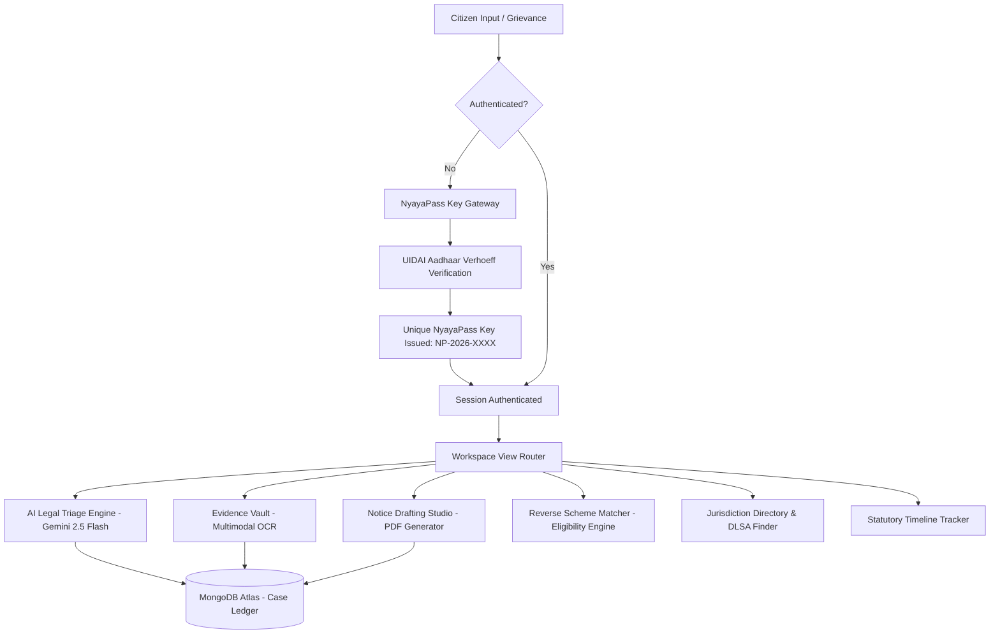

# ⚖️ NyayaSetu (न्याय सेतु)
### Sovereign AI Civic & Legal Action Engine for Indian Citizens

[](https://reactjs.org/)
[](https://vitejs.dev/)
[](https://nodejs.org/)
[](https://expressjs.com/)
[](https://ai.google.dev/)
[](https://www.mongodb.com/)
[](https://tailwindcss.com/)
[](LICENSE)

---

## 📌 Table of Contents
- [About NyayaSetu](#-about-nyayasetu)
- [Key Features & Capabilities](#-key-features--capabilities)
- [System Architecture](#-system-architecture)
- [Project Directory Structure](#-project-directory-structure)
- [Getting Started & Local Installation](#-getting-started--local-installation)
  - [Prerequisites](#prerequisites)
  - [1. Backend Setup](#1-backend-setup-nyayasetu-server)
  - [2. Frontend Setup](#2-frontend-setup-client)
- [API Reference](#-api-reference)
- [Statutory Frameworks & Standards](#-statutory-frameworks--standards)
- [Contributing](#-contributing)
- [License & Statutory Disclaimer](#-license--statutory-disclaimer)

---

## 🏛️ About NyayaSetu

**NyayaSetu (न्याय सेतु)** is an institutional-grade, citizen-first legal intelligence and civic grievance resolution platform designed specifically for the Indian legal framework. 

Access to justice in India is often hindered by procedural complexity, archaic terminology, transition to new criminal codes (**Bharatiya Nyaya Sanhita 2023**, **BNSS 2023**, **BSA 2023**), and the high cost of formal pre-litigation documentation. **NyayaSetu** bridges this gap by offering:

1. **Official UIDAI Verhoeff Checksum Verification** before access is granted.
2. **Unique NyayaPass Key-Based Authentication** to protect and bind citizen cases.
3. **AI Legal Triage & Rights Diagnosis** grounded in Indian penal and civil statutes.
4. **Forensic Multimodal Evidence OCR** for analyzing receipts, FIRs, invoices, and chats.
5. **Automated Statutory Notice & Petition Drafting Studio** with instant PDF generation.
6. **Reverse Welfare Scheme Matcher & Document-Gap Engine** for state and central benefits.

---

## ✨ Key Features & Capabilities

### 🔒 1. UIDAI Aadhaar Verification & NyayaPass Key Authentication
- **Verhoeff Dihedral Checksum ($D_5$):** Validates 12-digit Aadhaar numbers against the official UIDAI mathematical standard. Rejects invalid digits, counterfeit sequences, or numbers starting with 0/1.
- **Unique NyayaPass Access Key (`NP-2026-XXXX-XX-IN`):** Upon verified signup, citizens receive a lifetime sovereign access key with a 1-click copy feature and printable digital credential card.
- **Sovereign Feature Gatekeeper:** All interactive legal engines are strictly gated until unlocked with a verified NyayaPass Key.

### ⚖️ 2. AI Legal Triage & Rights Diagnosis
- Powered by **Google Gemini 2.5 Flash** with specialized legal system prompts.
- Analyzes plain-language grievances in English or Hindi and categorizes them under:
  - **Criminal / Safety:** BNS 2023, BNSS 2023 (Zero FIR Right under Section 173), POCSO, IT Act Sec 66E/67.
  - **Consumer Disputes:** Consumer Protection Act, 2019 (CPA Sec 35, e-Daakhil).
  - **Tenancy Law:** Model Tenancy Act, 2021 (Security deposit withholding under Sec 11).
  - **Transparency & Governance:** Right to Information Act, 2005 (RTI Sec 6(1)).
  - **Healthcare Rights:** PM-JAY Ayushman Bharat Patient Charter & Emergency Admission Rights.

### 📷 3. Multimodal Evidence Vault & Forensic OCR
- Ingests invoices, medical bills, rent agreements, WhatsApp chat logs, and police endorsement receipts.
- Automatically extracts merchant names, amounts, transaction dates, defect descriptions, and flags evidentiary gaps.

### 📜 4. Statutory Legal Notice Drafting Studio
- Auto-generates structured, legally compliant drafts with official government formatting:
  - **Pre-Litigation Consumer Demand Notice** (15-day cure window).
  - **Section 6(1) RTI Application** with prescribed format for Public Information Officers (PIO).
  - **Model Tenancy Deposit Refund Notice** under State Tenancy Authorities.
  - **Formal Police Representation / Zero FIR Petition**.
- Export directly to **Printable PDF** with timestamped legal disclaimers.

### 🏛️ 5. Reverse Welfare Scheme Matcher & Document-Gap Engine
- Cross-references citizen demographic parameters (State, District, Age, Gender, Income, Social Category) against Central and State welfare schemes (PM-JAY, PM-KISAN, Sukanya Samriddhi, PMAY, Old Age Pension, EWS Scholarship).
- Detects missing documents required to claim benefits and provides application links.

### 📍 6. National Jurisdiction & Free Legal Aid Finder
- Comprehensive directory mapping of:
  - District Consumer Disputes Redressal Commissions (**DCDRC**).
  - District Legal Services Authorities (**DLSA / NALSA** Free Legal Aid under Sec 12).
  - State Information Commissions (**SIC**).
  - Municipal Public Grievance Cells (Swachhata / 1076).

---

## 🏗️ System Architecture



---

## 📂 Project Directory Structure

```plaintext
NayayaSetu_OG/
├── client/                           # React + Vite Frontend Application
│   ├── src/
│   │   ├── components/
│   │   │   ├── auth/                 # AuthModal, NyayaPassCard, ProtectedFeatureGate
│   │   │   ├── common/               # Navbar, TopUtilityBar, EmergencyBanner, Footer
│   │   │   ├── diagnosis/            # AI Triage & Rights Diagnosis Component
│   │   │   ├── drafting/             # Notice & Petition Drafting Studio
│   │   │   ├── evidence/             # Forensic Evidence Vault & OCR Upload
│   │   │   ├── home/                 # Institutional Landing Page & Dispute Pills
│   │   │   ├── jurisdiction/         # District Consumer & Legal Aid Finder
│   │   │   ├── schemes/              # Welfare Scheme Matcher & Document Engine
│   │   │   ├── tracker/              # Statutory Limitation & Timeline Tracker
│   │   │   └── wiki/                 # Knowledge Base & Citizen Rights Wiki
│   │   ├── context/                  # AuthContext, CaseContext, LanguageContext
│   │   ├── services/                 # api.js (Axios Client), mockData.js
│   │   ├── App.jsx                   # Main Institutional Router & Gating View
│   │   └── main.jsx                  # React DOM Root
│   ├── package.json
│   ├── tailwind.config.js
│   └── vite.config.js
│
├── nyayasetu-server/                 # Express + Node.js Backend API
│   ├── config/                       # Database Configuration (Mongoose)
│   ├── controllers/                  # authController, intakeController, ragController
│   ├── middlewares/                  # Error Handling & Upload Middlewares
│   ├── models/                       # Case.js, UserRepository.js
│   ├── routes/                       # authRoutes, intakeRoutes, ragRoutes, civicRoutes
│   ├── services/                     # geminiService.js, ocrService.js
│   ├── server.js                     # Express Server Entrypoint
│   ├── package.json
│   └── .env.example                  # Environment Variables Template
│
├── .gitignore                        # Global Git Ignore File
└── README.md                         # Project Documentation
```

---

## 🚀 Getting Started & Local Installation

### Prerequisites
- **Node.js** v18.0.0 or higher
- **npm** or **yarn**
- **MongoDB** instance (Local or MongoDB Atlas)
- **Google Gemini API Key** ([Get free key from Google AI Studio](https://aistudio.google.com/))

---

### 1. Backend Setup (`nyayasetu-server`)

1. Open terminal and navigate to `nyayasetu-server`:
   ```bash
   cd nyayasetu-server
   ```

2. Install dependencies:
   ```bash
   npm install
   ```

3. Create your `.env` file from the template:
   ```bash
   cp .env.example .env
   ```

4. Configure environment variables in `.env`:
   ```env
   PORT=5005
   NODE_ENV=development
   FRONTEND_URL=http://localhost:3000
   MONGODB_URI=mongodb://localhost:27017/nyayasetu
   GEMINI_API_KEY=your_gemini_api_key_here
   ```

5. Start the backend server:
   ```bash
   npm start
   # Or for development mode with auto-reload:
   npm run dev
   ```
   Backend will be running at `http://localhost:5005`.

---

### 2. Frontend Setup (`client`)

1. Open a new terminal and navigate to `client`:
   ```bash
   cd client
   ```

2. Install dependencies:
   ```bash
   npm install
   ```

3. Start the Vite development server:
   ```bash
   npm run dev
   ```

4. Open your browser and navigate to:
   ```plaintext
   http://localhost:3000
   ```

---

## 📡 API Reference

| Method | Endpoint | Description | Auth Required |
| :--- | :--- | :--- | :---: |
| `POST` | `/api/auth/verify-aadhaar` | Validates 12-digit Aadhaar via Verhoeff checksum algorithm | No |
| `POST` | `/api/auth/signup` | Registers citizen and generates unique `NyayaPass` Key | Yes (Aadhaar Check) |
| `POST` | `/api/auth/login` | Validates NyayaPass Key or registered Aadhaar | No |
| `POST` | `/api/auth/verify-key` | Rapid validation of NyayaPass Key | No |
| `GET` | `/api/auth/verify-pass/:id` | Public verification endpoint for NyayaPass QR codes | No |
| `POST` | `/api/intake/diagnose` | Core AI legal diagnosis under Indian statutory law | Yes |
| `POST` | `/api/rag/query` | RAG search over Indian legal acts and statutes | Yes |
| `POST` | `/api/ocr/analyze` | Multimodal OCR & forensic evidence extraction | Yes |
| `POST` | `/api/civic-analysis/analyze` | Municipal civic grievance triage and draft generation | Yes |

---

## 📜 Statutory Frameworks & Standards

NyayaSetu is engineered to align with official Indian statutory mandates:
- **Digital Personal Data Protection Act (DPDP Act, 2023):** Aadhaar numbers are masked (`XXXX-XXXX-1234`) and hashes are secured using SHA-256 with no raw storage of identity biometric payloads.
- **Section 12, Legal Services Authorities Act, 1987:** Auto-identifies citizens eligible for 100% free legal representation via DLSA/NALSA (Women, Children, SC/ST, Income < ₹3,00,000).
- **Bharatiya Nagarik Suraksha Sanhita (BNSS, 2023):** Enforces citizen right to register **Zero FIR** under Section 173 regardless of jurisdictional boundaries.
- **Consumer Protection Act, 2019:** Pre-formats statutory demand notices for speedy redressal through District Consumer Commissions (DCDRC).

---

## 🤝 Contributing

Contributions are welcome! Please follow these steps:
1. Fork the repository.
2. Create a feature branch: `git checkout -b feature/AmazingFeature`
3. Commit your changes: `git commit -m 'Add AmazingFeature'`
4. Push to branch: `git push origin feature/AmazingFeature`
5. Open a Pull Request.

---

## ⚖️ License & Statutory Disclaimer

This project is licensed under the **MIT License** - see the [LICENSE](LICENSE) file for details.

> [!IMPORTANT]
> **Legal Disclaimer:** NyayaSetu is an AI-powered civic empowerment and legal awareness platform. The analyses, checklists, and document drafts generated by this platform are designed for informational, pre-litigation assistance and statutory orientation. They do not constitute formal attorney-client representation. Citizens are advised to verify legal facts and consult a qualified legal aid advocate or legal professional when formally appearing before judicial bodies.
